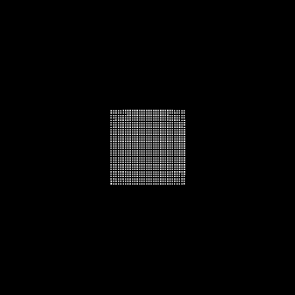

# Fake-Continuum-Materials-Simulation-2D
Experiments on simulating of continuum materials

Resources:

[incremental_mpm](https://github.com/nialltl/incremental_mpm) 

[PBMPM](https://github.com/electronicarts/pbmpm/tree/siggraph2024)

[3D GPU Implementation of PBMPM](https://github.com/dgerh/Breakpoint/tree/main)
